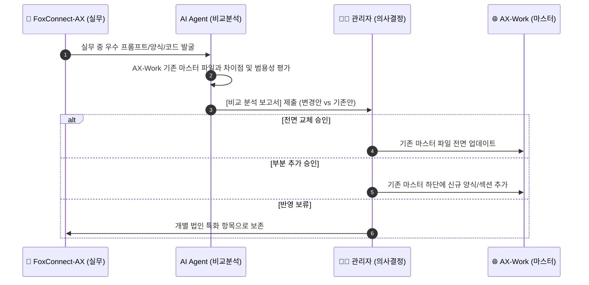

# 🌐 AX-Work | Universal Enterprise Asset Management Standard

<div align="center">


### **글로벌 기업 자산 관리 마스터 표준 청사진 저장소**
*특정 법인에 종속되지 않은 독자적 마스터 프레임워크, 자산 파싱 코어 엔진, 표준 서식 대장 모음*

---

</div>

> [!NOTE]
> **저장소의 역할 (Repository Identity)**
> **`AX-Work`**는 특정 기업이나 법인의 개별 데이터에 종속되지 않습니다. 부동산, 법인 차량, 기업 보험 등 기업 내 모든 자산 체계를 표준화·파싱·보고서화하기 위한 **독립적 마스터 프레임워크(Universal Master Standard)**입니다.

---


---

## 🚀 Quick Start & 초기 환경 구축 가이드
* **[📄 Antigravity CLI & Google Drive MCP 세팅 가이드 (Antigravity_CLI_GoogleDrive_Setup_Guide.md)](Antigravity_CLI_GoogleDrive_Setup_Guide.md)**
  * Python, Node.js, Antigravity CLI 설치부터 Google Cloud OAuth 2.0 발급, mcp.json 구성 및 구글드라이브 연동까지의 **5단계 기초 환경 구축 문서**입니다.


## 📐 1. 시스템 레이어 & 아키텍처 (System Architecture)

```mermaid
graph TD
    classDef docStyle fill:#1e1e2e,stroke:#89b4fa,stroke-width:2px,color:#cdd6f4;
    classDef engineStyle fill:#181825,stroke:#f9e2af,stroke-width:2px,color:#cdd6f4;
    classDef templateStyle fill:#1e1e2e,stroke:#a6e3a1,stroke-width:2px,color:#cdd6f4;
    classDef execStyle fill:#313244,stroke:#fab387,stroke-width:2px,color:#cdd6f4;

    subgraph Layer1 ["📄 Layer 1: 마스터 표준 문서 (Governance Standards)"]
        F1["Universal_Enterprise_Asset_Management_Framework.md<br/>(통합 자산 관리 프레임워크)"] ::: docStyle
        F2["Real_Estate_Management_Rules.md<br/>(부동산 자산 세부 규칙)"] ::: docStyle
        F3["Antigravity_CLI_GoogleDrive_Setup_Guide.md<br/>(구글 드라이브 MCP 세팅 가이드)"] ::: docStyle
    end

    subgraph Layer2 ["🧠 Layer 2: 코어 처리 엔진 (src/ Core Engines)"]
        E1["config.py<br/>(동적 환경 설정)"] ::: engineStyle
        E2["db_manager.py<br/>(SQLite 마스터 DB 엔진)"] ::: engineStyle
        E3["real_estate_engine.py<br/>(부동산 AI 파싱 엔진)"] ::: engineStyle
        E4["vehicle_engine.py<br/>(법인차량 파싱 엔진)"] ::: engineStyle
        E5["insurance_engine.py<br/>(기업보험 파싱 엔진)"] ::: engineStyle
        E6["template_exporter.py<br/>(보고서 출력 엔진)"] ::: engineStyle
    end

    subgraph Layer3 ["📑 Layer 3: 마스터 서식 템플릿 (templates/ Standard Templates)"]
        T1["Master_Corporate_Contract_Note_Overhead_Template.md"] ::: templateStyle
        T2["Corporate_Real_Estate_Contract_Note_Template.md"] ::: templateStyle
        T3["Corporate_Vehicle_Contract_Note_Template.md"] ::: templateStyle
        T4["Corporate_Insurance_Contract_Note_Template.md"] ::: templateStyle
        T5["External_Audit_IPO_Asset_Register_Template.md"] ::: templateStyle
    end

    subgraph Layer4 ["🏢 Layer 4: 기업별 실행 저장소 (Corporate Execution Repos)"]
        EX1["FoxConnect-AX<br/>((주)폭스커넥트 실무 저장소)"] ::: execStyle
        EX2["Other_Subsidiaries_AX<br/>(타 법인 실무 저장소)"] ::: execStyle
    end

    Layer1 --> Layer2
    Layer2 --> Layer3
    Layer3 -.->|표준 상속 및 적용| Layer4
    Layer4 -.->|우수 워크플로우 피드백| F1
```

---

## 🏛️ 2. 마스터 저장소 컴포넌트 구획표 (Component Map)

### 🛡️ Layer 1: 마스터 표준 문서 (Governance & Rules)
| 문서명 | 성격 및 범위 | 핵심 관리 영역 | 마스터 상태 |
| :--- | :--- | :--- | :---: |
| [Universal_Framework.md](Universal_Enterprise_Asset_Management_Framework.md) | **마스터 프레임워크** | 2단계 마스터 폴더 계층, 파일명 명명 규칙(`[파일순번]_[건물명]...`), AI OCR 파싱 원칙 | `Active Master` |
| [Real_Estate_Rules.md](Real_Estate_Management_Rules.md) | **부동산 실무 규칙** | A안(실무용), B안(외부감사/IPO용), C안(맞춤형) 리포트 출력 규격 정의 | `Active Master` |
| [Setup_Guide.md](Antigravity_CLI_GoogleDrive_Setup_Guide.md) | **환경 구축 가이드** | Google Drive MCP 연동, OAuth 설정, Antigravity CLI 환경 세팅 5단계 | `Active Master` |

### 🧠 Layer 2: 코어 파이썬 처리 엔진 (`src/`)
| 모듈명 | 엔진 구분 | 파이프라인 기능 및 역할 |
| :--- | :--- | :--- |
| [`src/config.py`](src/config.py) | **System Config** | 동적 경로 계산, 환경 변수 로드, 범용 설정 상수 정의 |
| [`src/db_manager.py`](src/db_manager.py) | **Database Core** | SQLite 기반 부동산·차량·보험 마스터 테이블 CRUD 및 데이터 무결성 보장 |
| [`src/folder_structure_engine.py`](src/folder_structure_engine.py) | **Folder Engine** | 1단계(건물 마스터) - 2단계(호수/층) 폴더 자동 생성 및 릴레이션 매핑 |
| [`src/real_estate_engine.py`](src/real_estate_engine.py) | **Real Estate Engine** | 부동산 임대차/전대차 계약서 PDF AI 파싱 및 18개 마스터 항목 추출 |
| [`src/vehicle_engine.py`](src/vehicle_engine.py) | **Vehicle Engine** | 법인 차량 리스/렌트/소유 계약서 및 정비/운행 이력 관리 |
| [`src/insurance_engine.py`](src/insurance_engine.py) | **Insurance Engine** | 법인 화재/배상/자동차/임원 보험 계약서 조건 파싱 및 만기 추적 |
| [`src/template_exporter.py`](src/template_exporter.py) | **Exporter Engine** | 파싱 데이터를 Word 계약노트(`.docx`) 및 External Audit Excel 대장(`.xlsx`) 내보내기 |

### 📑 Layer 3: 마스터 표준 서식 템플릿 (`templates/`)
| 템플릿 파일명 | 용도 및 적용 대상 | 특징 |
| :--- | :--- | :--- |
| [`Master_Corporate_Contract_...md`](templates/Master_Corporate_Contract_Note_Overhead_Template.md) | **통합 계약관리노트 최상위 규격** | 부동산, 법인차량, 기업보험 3대 자산 전체의 계약 이력을 통합 규정하는 워드(.docx) 최상위 마스터 서식 |
| [`Master_Corporate_Asset_...md`](templates/Master_Corporate_Asset_Register_Template.md) | **기업 통합 총괄자산대장 (SSOT)** | 2단계 표 분리(유효자산 ↔ 해지이력) 및 동적 업데이트 일자가 반영된 엑셀(.xlsx) 마스터 자산 대장 양식 |
| [`Corporate_Real_Estate_...md`](templates/Corporate_Real_Estate_Contract_Note_Template.md) | **부동산 자산 개별 서식** | 부동산 임대차 개별 계약 메타데이터 기재 양식 |
| [`Corporate_Vehicle_Contract_...md`](templates/Corporate_Vehicle_Contract_Note_Template.md) | **법인 차량 개별 서식** | 차량별 계약, 보험, 유지보수 개별 기록 양식 |
| [`Corporate_Insurance_...md`](templates/Corporate_Insurance_Contract_Note_Template.md) | **기업 보험 개별 서식** | 보험 종목별 보장 범위, 피보험자, 납입 정보 양식 |
| [`External_Audit_IPO_...md`](templates/External_Audit_IPO_Asset_Register_Template.md) | **외부감사 / IPO 제출용 뷰** | 회계법인 외부감사 및 상장(IPO) 제출 시 재무 검증 항목 위주로 필터링하여 추출하는 엑셀 뷰 양식 |

---

## 🔄 3. 선순환 이관 체계 (Continuous Feedback Loop)

> [!TIP]
> **마스터 표준 고도화 프로세스**
> 각 법인 저장소(`FoxConnect-AX` 등)에서 실무를 수행하며 검증된 우수한 템플릿, 프롬프트, 파이썬 코드는 아래의 3단계 승인 절차를 거쳐 본 마스터 저장소(`AX-Work`)로 반영됩니다.



---

## 🛡️ 4. 보안 및 마스터 운용 원칙

> [!IMPORTANT]
> **마스터 저장소 관리 규정**
> 1. **보안 지침**: 실제 기업 계약서 데이터, `.csv`, `.xlsx`, `.docx`, `.pdf`, `.db` 파일 등 개별 기업 데이터는 `.gitignore` 규칙에 의해 마스터 저장소에 커밋되지 않습니다.
> 2. **무결성 유지**: 본 저장소의 모든 표준 파일은 관리자의 승인을 받은 확인된 변경 사항만 커밋됩니다.
