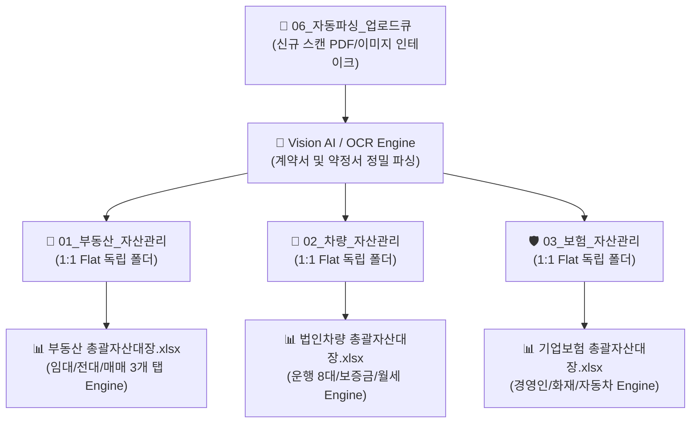

# 🏢 AX-Work: Universal Corporate Asset Management & Vision AI Engine
> **(기업 범용 AX 자산관리 및 비전 AI 문서자동화 프레임워크)**  
> **Repository Target**: `https://github.com/barista9980-cloud/AX-Work`  
> **Compliance Standard**: 외부감사(External Audit) 및 IPO 상장 대비 범용 자산관리 표준 엔진

---

## 📌 1. 시스템 개요 (Executive Summary)

`AX-Work`는 특정 법인에 종속되지 않고 **어느 기업에서나 즉시 도입할 수 있는 범용(Universal) 총무 자산관리 및 문서 자동화 프레임워크 엔진**입니다.

부동산(임대차/전대차/소유권), 법인차량(장기렌트/운용리스/승계), 기업보험(경영인정기보험/화재/자동차)의 자산 계약서를 **Vision AI 문서 인식 및 1:1 Flat 수평 구조**에 따라 표준화하고, **외부감사 및 IPO 상장 기준에 100% 부합하는 연도별 총괄자산대장(.xlsx)**을 일괄 생성합니다.



---

## ⚡ 2. Quick Start & Execution Guide (실행 안내)

단 한 줄의 명령어로 전체 자산관리 디렉토리 세팅 및 외감/IPO 마스터 엑셀 대장을 일괄 생성할 수 있습니다:

```bash
# 1. 전체 자산 파이프라인 일괄 실행 (디렉토리 세팅 + 부동산/차량/보험 엑셀 생성)
python main.py --all

# 2. 파라미터 지정을 통한 타 법인 적용 예시
python main.py --company "주식회사 ABC" --base-dir "G:\내 드라이브\[ABC]\[총무]업무" --snapshot-date "2025년 12월 31일"

# 3. 개별 자산 모듈만 실행
python main.py --real-estate   # 부동산 대장만 생성
python main.py --vehicle       # 법인차량 대장만 생성
python main.py --insurance     # 기업보험 대장만 생성
python main.py --setup-dirs    # 01~06 표준 디렉토리 및 업로드큐 초기 세팅
```

---

## 🧱 3. 모듈화된 소스 코드 아키텍처 (`src/`)

일회성 파편화 스크립트를 제거하고 **모듈화된 엔진 아키텍처**로 단권화되었습니다:

```text
AX-Work/
│
├── 📄 main.py                      # 🚀 통합 CLI 엔트리 포인트
├── 📄 README.md                    # 📖 범용 자산관리 레포지토리 설명서
├── 📄 .gitignore                   # 🔒 임시 및 개인정보 파일 예외 설정
│
├── 📁 src/                         # 🛠️ 범용 자산관리 핵심 엔진 모듈
│   ├── 📄 config.py                # ⚙️ 공통 서식, UI 컬러 토큰, 상태 배지 설정
│   ├── 📄 folder_structure_engine.py # 📂 01~06 디렉토리 및 고유 업로드큐 세팅 엔진
│   ├── 📄 real_estate_engine.py    # 🏢 부동산 3개 탭 마스터 엑셀 자동 생성 엔진
│   ├── 📄 vehicle_engine.py        # 🚗 법인차량 마스터 엑셀 자동 생성 엔진
│   └── 📄 insurance_engine.py      # 🛡️ 기업보험 마스터 엑셀 자동 생성 엔진
│
└── 📁 templates/                   # 📋 외감/IPO 표준 서식 및 마스터 템플릿
    ├── 📄 External_Audit_IPO_Asset_Register_Template.md
    └── 📄 Corporate_Insurance_Contract_Note_Template.md
```

---

## 📊 4. 외감 / IPO 대비 3대 마스터 엑셀 서식 수칙

| 구분 | 외감 / IPO 제출용 서식 표준 규격 (Formatting Rules) |
| :--- | :--- |
| **A열 여백** | Column A 여백 전용 설정 (`width = 3`), 표 데이터는 **Column B부터 시작** |
| **격자선 제거** | 배경 격자선 숨김 (`showGridLines = False`)으로 깔끔한 경영진 보고 UI 구현 |
| **선명한 테두리** | 표 내부 **검은색 단선 (`#000000`)** 적용으로 출력 및 문서 가독성 보장 |
| **단일 작성기준일** | `"현재"` 문구 전면 제거 ➔ **`작성 기준일: 2025년 12월 31일`** 잔액 Snapshot 표기 |
| **지수 표기 차단** | 증권번호(`0946352...`), 차량번호, 차대번호 지수표기 예방 (`@` 텍스트 서식 지정) |
| **상단 요약바** | Row 5에 **`작성 기준일: 2025-12-31 기준`** 유효 자산 총액 요약바 상시배치 |

---

## 🔒 5. 보안 및 시크릿(Secret) 관리 수칙

1. **API Key 보호**: 모든 Python 코드 및 문서에서 API Key 및 인증 토큰은 제거되었으며 환경 변수로 로드됩니다.
2. **범용성 보장**: 법인명, 기본 경로, 작성기준일을 파라미터화하여 어느 법인에서나 즉시 사용 가능합니다.

---

### 💻 Maintainer Info
- **Repository**: [https://github.com/barista9980-cloud/AX-Work](https://github.com/barista9980-cloud/AX-Work)
- **License**: Corporate Enterprise Proprietary / Universal Framework
